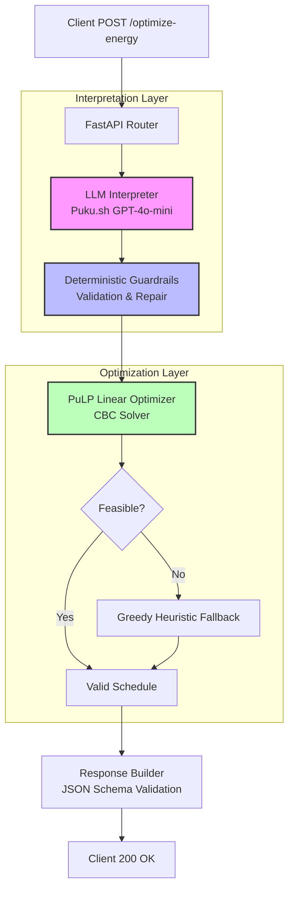

# GridWise LLM Energy Optimizer

**BUP CSE Fest 2026 Preliminary Challenge Solution**

## 🏗 Architecture Overview

The system implements a strict pipeline to ensure robustness, security, and compliance with the problem statement:



### Core Components

1.  **LLM Interpretation (`gridwise-llm/app/llm_interpreter.py`):**
    - Uses **Puku.sh** (OpenAI-compatible API) to parse natural language operator notes.
    - Temperature set to `0.0` for deterministic outputs.
    - Strict JSON schema enforcement via prompt engineering.
    - Handles timeouts and API failures gracefully by falling back to `no_op`.

2.  **Deterministic Guardrails (`gridwise-llm/app/guardrails.py`):**
    - Validates raw LLM output against physical constraints (Hours 0-23, Factors 0-1).
    - Repairs common errors (e.g., converting "1 PM to 3 PM" to `[13, 14]`).
    - Ensures exactly one interpretation per note, ordered by index.
    - Rejects hallucinated directives safely.

3.  **Mathematical Optimizer (`gridwise-llm/app/optimizer.py`):**
    - Solves the 24-hour energy scheduling problem using **Linear Programming (PuLP)**.
    - Objective: Minimize `total_cost_bdt`.
    - Constraints: Energy balance, battery physics, solar limits, and operator directives.
    - **Fallback Mechanism:** If the LP becomes infeasible due to conflicting directives, a greedy heuristic ensures a valid (though sub-optimal) schedule is returned instead of crashing.

## 🚀 Quick Start (Local Development)

### Prerequisites

- Python 3.12+
- Docker (optional, for containerized run)

### Installation & Run

```bash
# 1. Clone repository
git clone <your-repo-url>
cd gridwise-llm

# 2. Setup Virtual Environment
python -m venv venv
source venv/bin/activate  # On Windows: venv\Scripts\activate

# 3. Install Dependencies
pip install -r requirements.txt

# 4. Configure Secrets
cp .env.example .env
# Edit .env and add your PUKU_API_KEY

# 5. Start Server
uvicorn app.main:app --host 0.0.0.0 --port 8000 --reload
```

## ☁️ Deployment (Docker)

### Build Image

```bash
cd gridwise-llm
docker build -t gridwise-optimizer:latest .
```

### Run Container

Pass secrets via environment variables. Do **not** bake them into the image.

```bash
docker run -d \
  -p 8000:8000 \
  -e PUKU_API_KEY="your_real_key_here" \
  -e PUKU_BASE_URL="https://api.puku.sh/v1" \
  -e PUKU_MODEL="gpt-4o-mini" \
  --name gridwise-app \
  gridwise-optimizer:latest
```

## 🧪 Testing

All test scenarios and test scripts are centralized in the `tests/` directory.

### 1. Health Check
Verifies the service is up and listening.
```bash
curl http://localhost:8000/health
# Expected: {"status": "ok"}
```

### 2. Optimization Request
Send a sample scenario with operator notes:
```bash
curl -X POST http://localhost:8000/optimize-energy \
  -H "Content-Type: application/json" \
  -d @tests/test.json
```
*(Or `cd tests && curl -X POST http://localhost:8000/optimize-energy -H "Content-Type: application/json" -d @test.json`)*

### 3. Automated Test Suite
Run the automated test runner to validate all scenarios in `tests/`:
```bash
# Run unit & integration tests + live sample validation
./tests/run_tests.sh

# Or validate live endpoint directly against all test scenarios
python tests/test_public_samples.py http://localhost:8000
```

## 🔐 Security & Secrets

- **No Secrets in Repo:** `.env` is gitignored.
- **Runtime Injection:** API keys are passed via `-e` flags in Docker or environment variables in cloud platforms.
- **Error Handling:** Stack traces and sensitive data are suppressed in production responses.

## 📝 Known Limitations

- Relies on external LLM provider availability. Fallback logic ensures service continuity even if LLM fails (defaults to base optimization).
- LP solver assumes linear relationships; non-linear battery efficiency curves are not modeled (per problem statement simplification).

## 🛠 Tech Stack

- **Framework:** FastAPI (Python)
- **LLM Provider:** Puku.sh (OpenAI Compatible)
- **Optimizer:** PuLP (CBC Solver)
- **Containerization:** Docker
